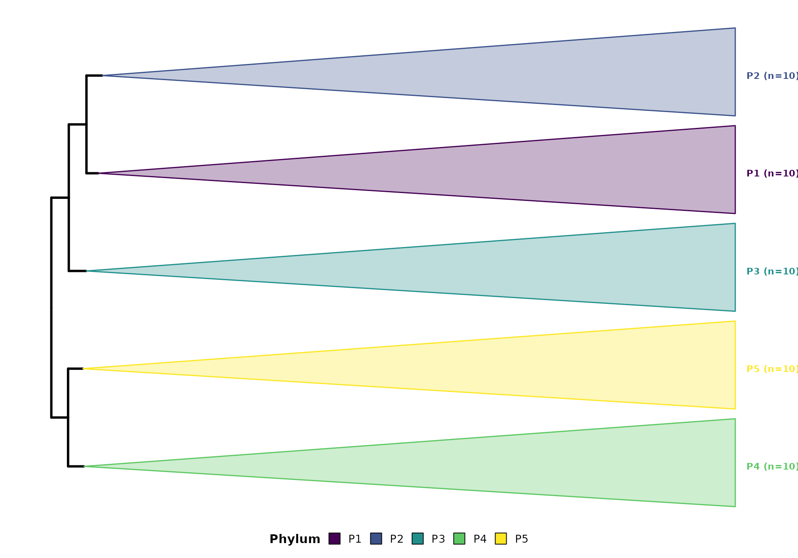

# Publication-Ready Output

## Color-Blind Friendly Palettes

Rclade defaults to the `viridis` palette, which is: - Color-blind
friendly - Grayscale friendly - Perceptually uniform

``` r

library(Rclade)
data(example_tree)

# Default viridis palette
p <- plot_timetree(example_tree, rank = "phylum",
                   taxonomy_format = "GTDB",
                   add_timescale = FALSE)
#> 
#> ============================================================
#>            Rclade: Phylogenetic Tree Visualization
#> ============================================================
#> 2026-10-01T07:02:41.473+00:00 | INFO     | Starting plot_timetree pipeline
#> 2026-10-01T07:02:41.474+00:00 | INFO     | Tree input               : phylo object
#> 2026-10-01T07:02:41.474+00:00 | INFO     | Rank                     : phylum
#> 2026-10-01T07:02:41.475+00:00 | INFO     | Layout                   : rectangular
#> 2026-10-01T07:02:41.475+00:00 | INFO     | Unit                     : auto
#> 2026-10-01T07:02:41.476+00:00 | INFO     | Step 1/7: Input validation and reading
#> 
#>   --------------------------------------------------
#>   >> Input Validation
#>   --------------------------------------------------
#> 2026-10-01T07:02:41.477+00:00 | INFO     | Tips                     : 50
#> 2026-10-01T07:02:41.477+00:00 | INFO     | Internal nodes           : 49
#> 2026-10-01T07:02:41.477+00:00 | INFO     | Edge lengths range       : 40.1579 to 2758.4006
#> 2026-10-01T07:02:41.478+00:00 | INFO     | Input validation passed
#> 2026-10-01T07:02:41.479+00:00 | INFO     | Timer 'input_reading': 3 ms
#> 2026-10-01T07:02:41.479+00:00 | INFO     | Step 2/7: Taxonomy parsing
#> 2026-10-01T07:02:41.479+00:00 | INFO     | Using rank-based taxonomy: phylum
#> 2026-10-01T07:02:41.486+00:00 | INFO     | Detected format          : GTDB
#> 2026-10-01T07:02:41.486+00:00 | INFO     | Groups found             : 5
#> 2026-10-01T07:02:41.487+00:00 | INFO     | Timer 'taxonomy_parsing': 7 ms
#> 2026-10-01T07:02:41.487+00:00 | INFO     | Step 3/7: MRCA computation and monophyly check
#> 2026-10-01T07:02:41.487+00:00 | INFO     | Checking monophyly and computing MRCA for each group...
#> 2026-10-01T07:02:41.490+00:00 | INFO     | Valid groups for collapse: 5 out of 5 total groups
#> 2026-10-01T07:02:41.491+00:00 | INFO     | Valid MRCA nodes         : 5
#> 2026-10-01T07:02:41.491+00:00 | INFO     | Timer 'mrca_computation': 4 ms
#> 2026-10-01T07:02:42.136+00:00 | INFO     | Step 4/7: Color generation
#> 2026-10-01T07:02:42.141+00:00 | INFO     | Color palette            : viridis
#> 2026-10-01T07:02:42.142+00:00 | INFO     | Step 5/7: Tree rendering
#> ! # Invaild edge matrix for <phylo>. A <tbl_df> is returned.
#> ! # Invaild edge matrix for <phylo>. A <tbl_df> is returned.
#> 2026-10-01T07:02:42.296+00:00 | INFO     | Collapsing 5 clades...
#> 2026-10-01T07:02:42.321+00:00 | INFO     | Clade collapse complete
#> 2026-10-01T07:02:42.322+00:00 | INFO     | Timer 'tree_rendering': 179 ms
#> 2026-10-01T07:02:42.322+00:00 | INFO     | Step 6/7: Timescale integration
#> 
#> ============================================================
#>                       Pipeline Complete
#> ============================================================
#> 2026-10-01T07:02:42.399+00:00 | INFO     |   Tips                        : 50
#> 2026-10-01T07:02:42.399+00:00 | INFO     |   Groups parsed               : 5
#> 2026-10-01T07:02:42.400+00:00 | INFO     |   Groups collapsed            : 5
#> 2026-10-01T07:02:42.400+00:00 | INFO     |   Singleton groups            : 0
#> 2026-10-01T07:02:42.400+00:00 | INFO     |   Skipped (non-monophyletic)  : 0
#> 2026-10-01T07:02:42.401+00:00 | INFO     |   Skipped (root/zero-tip)     : 0
#> 2026-10-01T07:02:42.401+00:00 | INFO     |   Taxonomy format             : GTDB
#> 2026-10-01T07:02:42.401+00:00 | INFO     |   Layout                      : rectangular
#> 2026-10-01T07:02:42.402+00:00 | INFO     |   Timescale                   : disabled
#> 2026-10-01T07:02:42.402+00:00 | INFO     | plot_timetree completed successfully
print(p)
```


## Custom Color Mapping

``` r

# Custom color mapping for specific groups
p <- plot_timetree(example_tree, rank = "phylum",
                   taxonomy_format = "GTDB",
                   add_timescale = FALSE,
                   color_mapping = c("Proteobacteria" = "#E41A1C",
                                     "Firmicutes" = "#377EB8"))
#> 
#> ============================================================
#>            Rclade: Phylogenetic Tree Visualization
#> ============================================================
#> 2026-10-01T07:02:42.852+00:00 | INFO     | Starting plot_timetree pipeline
#> 2026-10-01T07:02:42.852+00:00 | INFO     | Tree input               : phylo object
#> 2026-10-01T07:02:42.853+00:00 | INFO     | Rank                     : phylum
#> 2026-10-01T07:02:42.853+00:00 | INFO     | Layout                   : rectangular
#> 2026-10-01T07:02:42.853+00:00 | INFO     | Unit                     : auto
#> 2026-10-01T07:02:42.854+00:00 | INFO     | Step 1/7: Input validation and reading
#> 
#>   --------------------------------------------------
#>   >> Input Validation
#>   --------------------------------------------------
#> 2026-10-01T07:02:42.854+00:00 | INFO     | Tips                     : 50
#> 2026-10-01T07:02:42.855+00:00 | INFO     | Internal nodes           : 49
#> 2026-10-01T07:02:42.855+00:00 | INFO     | Edge lengths range       : 40.1579 to 2758.4006
#> 2026-10-01T07:02:42.856+00:00 | INFO     | Input validation passed
#> 2026-10-01T07:02:42.856+00:00 | INFO     | Timer 'input_reading': 2 ms
#> 2026-10-01T07:02:42.856+00:00 | INFO     | Step 2/7: Taxonomy parsing
#> 2026-10-01T07:02:42.857+00:00 | INFO     | Using rank-based taxonomy: phylum
#> 2026-10-01T07:02:42.862+00:00 | INFO     | Detected format          : GTDB
#> 2026-10-01T07:02:42.863+00:00 | INFO     | Groups found             : 5
#> 2026-10-01T07:02:42.863+00:00 | INFO     | Timer 'taxonomy_parsing': 7 ms
#> 2026-10-01T07:02:42.863+00:00 | INFO     | Step 3/7: MRCA computation and monophyly check
#> 2026-10-01T07:02:42.864+00:00 | INFO     | Checking monophyly and computing MRCA for each group...
#> 2026-10-01T07:02:42.866+00:00 | INFO     | Valid groups for collapse: 5 out of 5 total groups
#> 2026-10-01T07:02:42.866+00:00 | INFO     | Valid MRCA nodes         : 5
#> 2026-10-01T07:02:42.867+00:00 | INFO     | Timer 'mrca_computation': 3 ms
#> 2026-10-01T07:02:42.867+00:00 | INFO     | Step 4/7: Color generation
#> 2026-10-01T07:02:42.868+00:00 | INFO     | Color palette            : viridis
#> 2026-10-01T07:02:42.869+00:00 | INFO     | Step 5/7: Tree rendering
#> ! # Invaild edge matrix for <phylo>. A <tbl_df> is returned.
#> ! # Invaild edge matrix for <phylo>. A <tbl_df> is returned.
#> 2026-10-01T07:02:42.959+00:00 | INFO     | Collapsing 5 clades...
#> 2026-10-01T07:02:42.982+00:00 | INFO     | Clade collapse complete
#> 2026-10-01T07:02:42.983+00:00 | INFO     | Timer 'tree_rendering': 114 ms
#> 2026-10-01T07:02:42.983+00:00 | INFO     | Step 6/7: Timescale integration
#> 
#> ============================================================
#>                       Pipeline Complete
#> ============================================================
#> 2026-10-01T07:02:43.048+00:00 | INFO     |   Tips                        : 50
#> 2026-10-01T07:02:43.049+00:00 | INFO     |   Groups parsed               : 5
#> 2026-10-01T07:02:43.049+00:00 | INFO     |   Groups collapsed            : 5
#> 2026-10-01T07:02:43.049+00:00 | INFO     |   Singleton groups            : 0
#> 2026-10-01T07:02:43.049+00:00 | INFO     |   Skipped (non-monophyletic)  : 0
#> 2026-10-01T07:02:43.050+00:00 | INFO     |   Skipped (root/zero-tip)     : 0
#> 2026-10-01T07:02:43.050+00:00 | INFO     |   Taxonomy format             : GTDB
#> 2026-10-01T07:02:43.050+00:00 | INFO     |   Layout                      : rectangular
#> 2026-10-01T07:02:43.050+00:00 | INFO     |   Timescale                   : disabled
#> 2026-10-01T07:02:43.051+00:00 | INFO     | plot_timetree completed successfully
print(p)
```


## Legend Placement

``` r

# Inside the plot (default)
p <- plot_timetree(example_tree, rank = "phylum",
                   taxonomy_format = "GTDB",
                   add_timescale = FALSE,
                   legend_position = c(0.05, 0.85))
#> 
#> ============================================================
#>            Rclade: Phylogenetic Tree Visualization
#> ============================================================
#> 2026-10-01T07:02:43.530+00:00 | INFO     | Starting plot_timetree pipeline
#> 2026-10-01T07:02:43.531+00:00 | INFO     | Tree input               : phylo object
#> 2026-10-01T07:02:43.531+00:00 | INFO     | Rank                     : phylum
#> 2026-10-01T07:02:43.531+00:00 | INFO     | Layout                   : rectangular
#> 2026-10-01T07:02:43.531+00:00 | INFO     | Unit                     : auto
#> 2026-10-01T07:02:43.532+00:00 | INFO     | Step 1/7: Input validation and reading
#> 
#>   --------------------------------------------------
#>   >> Input Validation
#>   --------------------------------------------------
#> 2026-10-01T07:02:43.533+00:00 | INFO     | Tips                     : 50
#> 2026-10-01T07:02:43.533+00:00 | INFO     | Internal nodes           : 49
#> 2026-10-01T07:02:43.533+00:00 | INFO     | Edge lengths range       : 40.1579 to 2758.4006
#> 2026-10-01T07:02:43.534+00:00 | INFO     | Input validation passed
#> 2026-10-01T07:02:43.534+00:00 | INFO     | Timer 'input_reading': 2 ms
#> 2026-10-01T07:02:43.535+00:00 | INFO     | Step 2/7: Taxonomy parsing
#> 2026-10-01T07:02:43.535+00:00 | INFO     | Using rank-based taxonomy: phylum
#> 2026-10-01T07:02:43.541+00:00 | INFO     | Detected format          : GTDB
#> 2026-10-01T07:02:43.542+00:00 | INFO     | Groups found             : 5
#> 2026-10-01T07:02:43.542+00:00 | INFO     | Timer 'taxonomy_parsing': 7 ms
#> 2026-10-01T07:02:43.542+00:00 | INFO     | Step 3/7: MRCA computation and monophyly check
#> 2026-10-01T07:02:43.542+00:00 | INFO     | Checking monophyly and computing MRCA for each group...
#> 2026-10-01T07:02:43.545+00:00 | INFO     | Valid groups for collapse: 5 out of 5 total groups
#> 2026-10-01T07:02:43.545+00:00 | INFO     | Valid MRCA nodes         : 5
#> 2026-10-01T07:02:43.545+00:00 | INFO     | Timer 'mrca_computation': 3 ms
#> 2026-10-01T07:02:43.546+00:00 | INFO     | Step 4/7: Color generation
#> 2026-10-01T07:02:43.547+00:00 | INFO     | Color palette            : viridis
#> 2026-10-01T07:02:43.548+00:00 | INFO     | Step 5/7: Tree rendering
#> ! # Invaild edge matrix for <phylo>. A <tbl_df> is returned.
#> ! # Invaild edge matrix for <phylo>. A <tbl_df> is returned.
#> 2026-10-01T07:02:43.645+00:00 | INFO     | Collapsing 5 clades...
#> 2026-10-01T07:02:43.669+00:00 | INFO     | Clade collapse complete
#> 2026-10-01T07:02:43.669+00:00 | INFO     | Timer 'tree_rendering': 121 ms
#> 2026-10-01T07:02:43.669+00:00 | INFO     | Step 6/7: Timescale integration
#> 
#> ============================================================
#>                       Pipeline Complete
#> ============================================================
#> 2026-10-01T07:02:43.737+00:00 | INFO     |   Tips                        : 50
#> 2026-10-01T07:02:43.738+00:00 | INFO     |   Groups parsed               : 5
#> 2026-10-01T07:02:43.738+00:00 | INFO     |   Groups collapsed            : 5
#> 2026-10-01T07:02:43.738+00:00 | INFO     |   Singleton groups            : 0
#> 2026-10-01T07:02:43.738+00:00 | INFO     |   Skipped (non-monophyletic)  : 0
#> 2026-10-01T07:02:43.739+00:00 | INFO     |   Skipped (root/zero-tip)     : 0
#> 2026-10-01T07:02:43.739+00:00 | INFO     |   Taxonomy format             : GTDB
#> 2026-10-01T07:02:43.739+00:00 | INFO     |   Layout                      : rectangular
#> 2026-10-01T07:02:43.739+00:00 | INFO     |   Timescale                   : disabled
#> 2026-10-01T07:02:43.740+00:00 | INFO     | plot_timetree completed successfully

# Standard positions
p <- plot_timetree(example_tree, rank = "phylum",
                   taxonomy_format = "GTDB",
                   add_timescale = FALSE,
                   legend_position = "right")
#> 
#> ============================================================
#>            Rclade: Phylogenetic Tree Visualization
#> ============================================================
#> 2026-10-01T07:02:43.741+00:00 | INFO     | Starting plot_timetree pipeline
#> 2026-10-01T07:02:43.741+00:00 | INFO     | Tree input               : phylo object
#> 2026-10-01T07:02:43.741+00:00 | INFO     | Rank                     : phylum
#> 2026-10-01T07:02:43.741+00:00 | INFO     | Layout                   : rectangular
#> 2026-10-01T07:02:43.742+00:00 | INFO     | Unit                     : auto
#> 2026-10-01T07:02:43.742+00:00 | INFO     | Step 1/7: Input validation and reading
#> 
#>   --------------------------------------------------
#>   >> Input Validation
#>   --------------------------------------------------
#> 2026-10-01T07:02:43.743+00:00 | INFO     | Tips                     : 50
#> 2026-10-01T07:02:43.743+00:00 | INFO     | Internal nodes           : 49
#> 2026-10-01T07:02:43.743+00:00 | INFO     | Edge lengths range       : 40.1579 to 2758.4006
#> 2026-10-01T07:02:43.744+00:00 | INFO     | Input validation passed
#> 2026-10-01T07:02:43.745+00:00 | INFO     | Timer 'input_reading': 2 ms
#> 2026-10-01T07:02:43.745+00:00 | INFO     | Step 2/7: Taxonomy parsing
#> 2026-10-01T07:02:43.745+00:00 | INFO     | Using rank-based taxonomy: phylum
#> 2026-10-01T07:02:43.751+00:00 | INFO     | Detected format          : GTDB
#> 2026-10-01T07:02:43.751+00:00 | INFO     | Groups found             : 5
#> 2026-10-01T07:02:43.752+00:00 | INFO     | Timer 'taxonomy_parsing': 7 ms
#> 2026-10-01T07:02:43.752+00:00 | INFO     | Step 3/7: MRCA computation and monophyly check
#> 2026-10-01T07:02:43.752+00:00 | INFO     | Checking monophyly and computing MRCA for each group...
#> 2026-10-01T07:02:43.754+00:00 | INFO     | Valid groups for collapse: 5 out of 5 total groups
#> 2026-10-01T07:02:43.755+00:00 | INFO     | Valid MRCA nodes         : 5
#> 2026-10-01T07:02:43.755+00:00 | INFO     | Timer 'mrca_computation': 3 ms
#> 2026-10-01T07:02:43.756+00:00 | INFO     | Step 4/7: Color generation
#> 2026-10-01T07:02:43.757+00:00 | INFO     | Color palette            : viridis
#> 2026-10-01T07:02:43.757+00:00 | INFO     | Step 5/7: Tree rendering
#> ! # Invaild edge matrix for <phylo>. A <tbl_df> is returned.
#> ! # Invaild edge matrix for <phylo>. A <tbl_df> is returned.
#> 2026-10-01T07:02:43.844+00:00 | INFO     | Collapsing 5 clades...
#> 2026-10-01T07:02:43.870+00:00 | INFO     | Clade collapse complete
#> 2026-10-01T07:02:43.871+00:00 | INFO     | Timer 'tree_rendering': 113 ms
#> 2026-10-01T07:02:43.871+00:00 | INFO     | Step 6/7: Timescale integration
#> 
#> ============================================================
#>                       Pipeline Complete
#> ============================================================
#> 2026-10-01T07:02:43.930+00:00 | INFO     |   Tips                        : 50
#> 2026-10-01T07:02:43.931+00:00 | INFO     |   Groups parsed               : 5
#> 2026-10-01T07:02:43.931+00:00 | INFO     |   Groups collapsed            : 5
#> 2026-10-01T07:02:43.931+00:00 | INFO     |   Singleton groups            : 0
#> 2026-10-01T07:02:43.931+00:00 | INFO     |   Skipped (non-monophyletic)  : 0
#> 2026-10-01T07:02:43.932+00:00 | INFO     |   Skipped (root/zero-tip)     : 0
#> 2026-10-01T07:02:43.932+00:00 | INFO     |   Taxonomy format             : GTDB
#> 2026-10-01T07:02:43.932+00:00 | INFO     |   Layout                      : rectangular
#> 2026-10-01T07:02:43.932+00:00 | INFO     |   Timescale                   : disabled
#> 2026-10-01T07:02:43.933+00:00 | INFO     | plot_timetree completed successfully
```

## Clade Labels

``` r

p <- plot_timetree(example_tree, rank = "phylum",
                   taxonomy_format = "GTDB",
                   add_timescale = FALSE,
                   show_clade_label = TRUE)
#> 
#> ============================================================
#>            Rclade: Phylogenetic Tree Visualization
#> ============================================================
#> 2026-10-01T07:02:44.024+00:00 | INFO     | Starting plot_timetree pipeline
#> 2026-10-01T07:02:44.025+00:00 | INFO     | Tree input               : phylo object
#> 2026-10-01T07:02:44.025+00:00 | INFO     | Rank                     : phylum
#> 2026-10-01T07:02:44.025+00:00 | INFO     | Layout                   : rectangular
#> 2026-10-01T07:02:44.025+00:00 | INFO     | Unit                     : auto
#> 2026-10-01T07:02:44.026+00:00 | INFO     | Step 1/7: Input validation and reading
#> 
#>   --------------------------------------------------
#>   >> Input Validation
#>   --------------------------------------------------
#> 2026-10-01T07:02:44.027+00:00 | INFO     | Tips                     : 50
#> 2026-10-01T07:02:44.027+00:00 | INFO     | Internal nodes           : 49
#> 2026-10-01T07:02:44.027+00:00 | INFO     | Edge lengths range       : 40.1579 to 2758.4006
#> 2026-10-01T07:02:44.028+00:00 | INFO     | Input validation passed
#> 2026-10-01T07:02:44.028+00:00 | INFO     | Timer 'input_reading': 2 ms
#> 2026-10-01T07:02:44.029+00:00 | INFO     | Step 2/7: Taxonomy parsing
#> 2026-10-01T07:02:44.029+00:00 | INFO     | Using rank-based taxonomy: phylum
#> 2026-10-01T07:02:44.035+00:00 | INFO     | Detected format          : GTDB
#> 2026-10-01T07:02:44.035+00:00 | INFO     | Groups found             : 5
#> 2026-10-01T07:02:44.035+00:00 | INFO     | Timer 'taxonomy_parsing': 7 ms
#> 2026-10-01T07:02:44.036+00:00 | INFO     | Step 3/7: MRCA computation and monophyly check
#> 2026-10-01T07:02:44.036+00:00 | INFO     | Checking monophyly and computing MRCA for each group...
#> 2026-10-01T07:02:44.038+00:00 | INFO     | Valid groups for collapse: 5 out of 5 total groups
#> 2026-10-01T07:02:44.038+00:00 | INFO     | Valid MRCA nodes         : 5
#> 2026-10-01T07:02:44.039+00:00 | INFO     | Timer 'mrca_computation': 3 ms
#> 2026-10-01T07:02:44.039+00:00 | INFO     | Step 4/7: Color generation
#> 2026-10-01T07:02:44.040+00:00 | INFO     | Color palette            : viridis
#> 2026-10-01T07:02:44.041+00:00 | INFO     | Step 5/7: Tree rendering
#> ! # Invaild edge matrix for <phylo>. A <tbl_df> is returned.
#> ! # Invaild edge matrix for <phylo>. A <tbl_df> is returned.
#> 2026-10-01T07:02:44.129+00:00 | INFO     | Collapsing 5 clades...
#> 2026-10-01T07:02:44.151+00:00 | INFO     | Clade collapse complete
#> 2026-10-01T07:02:44.151+00:00 | INFO     | Timer 'tree_rendering': 110 ms
#> 2026-10-01T07:02:44.152+00:00 | INFO     | Step 6/7: Timescale integration
#> 
#> ============================================================
#>                       Pipeline Complete
#> ============================================================
#> 2026-10-01T07:02:44.219+00:00 | INFO     |   Tips                        : 50
#> 2026-10-01T07:02:44.219+00:00 | INFO     |   Groups parsed               : 5
#> 2026-10-01T07:02:44.219+00:00 | INFO     |   Groups collapsed            : 5
#> 2026-10-01T07:02:44.220+00:00 | INFO     |   Singleton groups            : 0
#> 2026-10-01T07:02:44.220+00:00 | INFO     |   Skipped (non-monophyletic)  : 0
#> 2026-10-01T07:02:44.220+00:00 | INFO     |   Skipped (root/zero-tip)     : 0
#> 2026-10-01T07:02:44.220+00:00 | INFO     |   Taxonomy format             : GTDB
#> 2026-10-01T07:02:44.221+00:00 | INFO     |   Layout                      : rectangular
#> 2026-10-01T07:02:44.221+00:00 | INFO     |   Timescale                   : disabled
#> 2026-10-01T07:02:44.221+00:00 | INFO     | plot_timetree completed successfully
print(p)
```



## Taxonomy Quality Report

Before finalizing your figure, verify label parsing quality:

``` r

summarize_taxonomy_quality(example_tree$tip.label, format = "GTDB")
#> === Taxonomy Label Parsing Quality Report ===
#> Total labels: 50
#> Detected format: GTDB
#> 
#> Per-rank parse rates:
#>   kingdom        0.0% (0/50) 
#>   domain       100.0% (50/50) ====================
#>   phylum       100.0% (50/50) ====================
#>   class        100.0% (50/50) ====================
#>   order          0.0% (0/50) 
#>   family         0.0% (0/50) 
#>   genus          0.0% (0/50) 
#>   species        0.0% (0/50) 
#>   subspecies     0.0% (0/50) 
#> 
#> All labels parsed successfully.
```

## Batch Processing

Process multiple tree files at once:

``` r

batch_plot(input_dir = "trees/",
           output_dir = "figures/",
           pattern = "*.tre",
           rank = "phylum",
           taxonomy_format = "GTDB")
```

## Reproducibility

``` r

save_session_info("session_info.txt")
```

## References & Acknowledgments

Rclade builds on the **ggtree** and **deeptime** R packages. If you use
Rclade in published research, please cite Rclade along with these key
dependencies:

- Yu G, Smith DK, Zhu H, Guan Y, Lam TT-Y (2017). “ggtree: an R package
  for visualization and annotation of phylogenetic trees with their
  covariates and other associated data.” *Methods in Ecology and
  Evolution*, 8(1), 28-36. <doi:10.1111/2041-210X.12628>
- Gearty W (2025). “deeptime: an R package that facilitates highly
  customizable and reproducible visualizations of data over geological
  time intervals.” *Big Earth Data*. <doi:10.1080/20964471.2025.2537516>

The geological timescale data is based on the ICS International
Chronostratigraphic Chart 2023/02 (<https://stratigraphy.org/chart/>).
