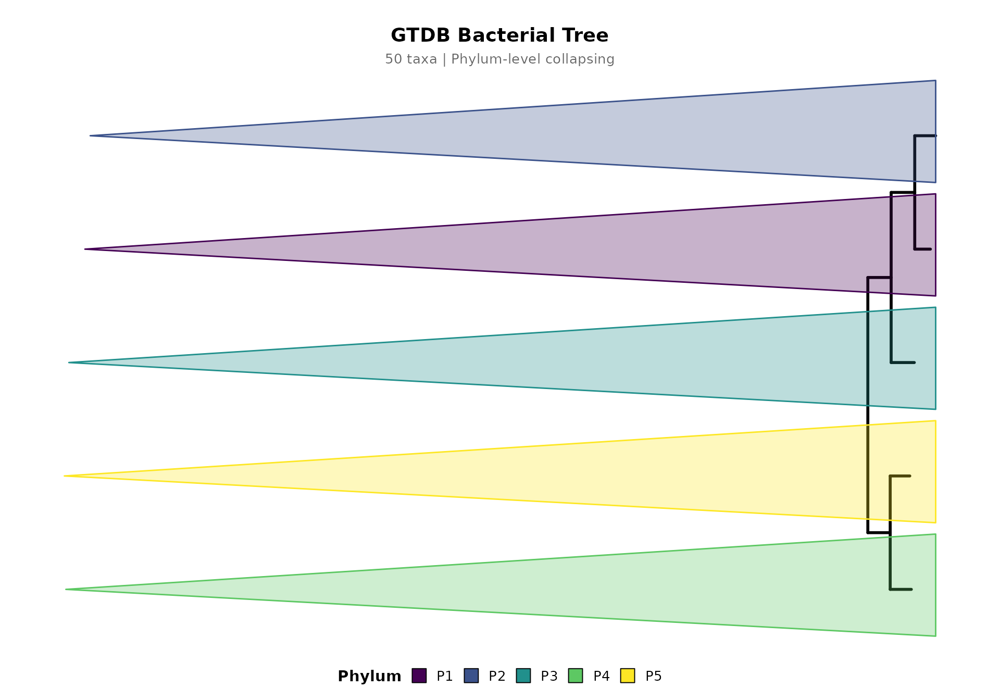

# Quick Start: From Tree File to Publication Figure

## Installation

``` r

# Install from local source package
install.packages("path/to/Rclade_1.0.0.tar.gz", repos = NULL, type = "source")
```

## Basic Usage

The simplest way to create a timetree visualization using the built-in
example data:

``` r

library(Rclade)

# Load built-in example tree (50 tips, GTDB-style labels)
data(example_tree)

# Plot with phylum-level collapsing (no timescale for speed)
p <- plot_timetree(example_tree, rank = "phylum",
                   taxonomy_format = "GTDB",
                   add_timescale = FALSE)
#> 
#> ============================================================
#>            Rclade: Phylogenetic Tree Visualization
#> ============================================================
#> 2026-08-16T06:55:04.803+00:00 | INFO     | Starting plot_timetree pipeline
#> 2026-08-16T06:55:04.804+00:00 | INFO     | Tree input               : phylo object
#> 2026-08-16T06:55:04.805+00:00 | INFO     | Rank                     : phylum
#> 2026-08-16T06:55:04.805+00:00 | INFO     | Layout                   : rectangular
#> 2026-08-16T06:55:04.806+00:00 | INFO     | Unit                     : auto
#> 2026-08-16T06:55:04.807+00:00 | INFO     | Step 1/7: Input validation and reading
#> 
#>   --------------------------------------------------
#>   >> Input Validation
#>   --------------------------------------------------
#> 2026-08-16T06:55:04.818+00:00 | INFO     | Tips                     : 50
#> 2026-08-16T06:55:04.819+00:00 | INFO     | Internal nodes           : 49
#> 2026-08-16T06:55:04.819+00:00 | INFO     | Edge lengths range       : 40.1579 to 2758.4006
#> 2026-08-16T06:55:04.820+00:00 | INFO     | Input validation passed
#> 2026-08-16T06:55:04.821+00:00 | INFO     | Timer 'input_reading': 14 ms
#> 2026-08-16T06:55:04.822+00:00 | INFO     | Step 2/7: Taxonomy parsing
#> 2026-08-16T06:55:04.822+00:00 | INFO     | Using rank-based taxonomy: phylum
#> 2026-08-16T06:55:04.832+00:00 | INFO     | Detected format          : GTDB
#> 2026-08-16T06:55:04.832+00:00 | INFO     | Groups found             : 5
#> 2026-08-16T06:55:04.833+00:00 | INFO     | Timer 'taxonomy_parsing': 11 ms
#> 2026-08-16T06:55:04.834+00:00 | INFO     | Step 3/7: MRCA computation and monophyly check
#> 2026-08-16T06:55:04.834+00:00 | INFO     | Checking monophyly and computing MRCA for each group...
#> 2026-08-16T06:55:04.839+00:00 | INFO     | Valid groups for collapse: 5 out of 5 total groups
#> 2026-08-16T06:55:04.840+00:00 | INFO     | Valid MRCA nodes         : 5
#> 2026-08-16T06:55:04.841+00:00 | INFO     | Timer 'mrca_computation': 6 ms
#> 2026-08-16T06:55:05.749+00:00 | INFO     | Step 4/7: Color generation
#> 2026-08-16T06:55:05.758+00:00 | INFO     | Color palette            : viridis
#> 2026-08-16T06:55:05.759+00:00 | INFO     | Step 5/7: Tree rendering
#> ! # Invaild edge matrix for <phylo>. A <tbl_df> is returned.
#> ! # Invaild edge matrix for <phylo>. A <tbl_df> is returned.
#> 2026-08-16T06:55:06.018+00:00 | INFO     | Collapsing 5 clades...
#> 2026-08-16T06:55:06.060+00:00 | INFO     | Clade collapse complete
#> 2026-08-16T06:55:06.060+00:00 | INFO     | Timer 'tree_rendering': 301 ms
#> 2026-08-16T06:55:06.061+00:00 | INFO     | Step 6/7: Timescale integration
#> 
#> ============================================================
#>                       Pipeline Complete
#> ============================================================
#> 2026-08-16T06:55:06.175+00:00 | INFO     |   Tips              : 50
#> 2026-08-16T06:55:06.176+00:00 | INFO     |   Groups            : 5
#> 2026-08-16T06:55:06.176+00:00 | INFO     |   Groups collapsed  : 5
#> 2026-08-16T06:55:06.176+00:00 | INFO     |   Taxonomy format   : GTDB
#> 2026-08-16T06:55:06.177+00:00 | INFO     |   Layout            : rectangular
#> 2026-08-16T06:55:06.177+00:00 | INFO     |   Timescale         : disabled
#> 2026-08-16T06:55:06.178+00:00 | INFO     | plot_timetree completed successfully
print(p)
```


## Adding Titles

Use `main_title` and `sub_title` to add centered titles:

``` r

p <- plot_timetree(example_tree, rank = "phylum",
                   taxonomy_format = "GTDB",
                   add_timescale = FALSE,
                   main_title = "GTDB Bacterial Tree",
                   sub_title = "50 taxa | Phylum-level collapsing")
#> 
#> ============================================================
#>            Rclade: Phylogenetic Tree Visualization
#> ============================================================
#> 2026-08-16T06:55:06.790+00:00 | INFO     | Starting plot_timetree pipeline
#> 2026-08-16T06:55:06.790+00:00 | INFO     | Tree input               : phylo object
#> 2026-08-16T06:55:06.790+00:00 | INFO     | Rank                     : phylum
#> 2026-08-16T06:55:06.791+00:00 | INFO     | Layout                   : rectangular
#> 2026-08-16T06:55:06.791+00:00 | INFO     | Unit                     : auto
#> 2026-08-16T06:55:06.792+00:00 | INFO     | Step 1/7: Input validation and reading
#> 
#>   --------------------------------------------------
#>   >> Input Validation
#>   --------------------------------------------------
#> 2026-08-16T06:55:06.793+00:00 | INFO     | Tips                     : 50
#> 2026-08-16T06:55:06.793+00:00 | INFO     | Internal nodes           : 49
#> 2026-08-16T06:55:06.794+00:00 | INFO     | Edge lengths range       : 40.1579 to 2758.4006
#> 2026-08-16T06:55:06.795+00:00 | INFO     | Input validation passed
#> 2026-08-16T06:55:06.795+00:00 | INFO     | Timer 'input_reading': 3 ms
#> 2026-08-16T06:55:06.796+00:00 | INFO     | Step 2/7: Taxonomy parsing
#> 2026-08-16T06:55:06.796+00:00 | INFO     | Using rank-based taxonomy: phylum
#> 2026-08-16T06:55:06.805+00:00 | INFO     | Detected format          : GTDB
#> 2026-08-16T06:55:06.805+00:00 | INFO     | Groups found             : 5
#> 2026-08-16T06:55:06.806+00:00 | INFO     | Timer 'taxonomy_parsing': 10 ms
#> 2026-08-16T06:55:06.807+00:00 | INFO     | Step 3/7: MRCA computation and monophyly check
#> 2026-08-16T06:55:06.807+00:00 | INFO     | Checking monophyly and computing MRCA for each group...
#> 2026-08-16T06:55:06.810+00:00 | INFO     | Valid groups for collapse: 5 out of 5 total groups
#> 2026-08-16T06:55:06.811+00:00 | INFO     | Valid MRCA nodes         : 5
#> 2026-08-16T06:55:06.811+00:00 | INFO     | Timer 'mrca_computation': 4 ms
#> 2026-08-16T06:55:06.812+00:00 | INFO     | Step 4/7: Color generation
#> 2026-08-16T06:55:06.814+00:00 | INFO     | Color palette            : viridis
#> 2026-08-16T06:55:06.814+00:00 | INFO     | Step 5/7: Tree rendering
#> ! # Invaild edge matrix for <phylo>. A <tbl_df> is returned.
#> ! # Invaild edge matrix for <phylo>. A <tbl_df> is returned.
#> 2026-08-16T06:55:06.956+00:00 | INFO     | Collapsing 5 clades...
#> 2026-08-16T06:55:06.993+00:00 | INFO     | Clade collapse complete
#> 2026-08-16T06:55:06.994+00:00 | INFO     | Timer 'tree_rendering': 179 ms
#> 2026-08-16T06:55:06.994+00:00 | INFO     | Step 6/7: Timescale integration
#> 
#> ============================================================
#>                       Pipeline Complete
#> ============================================================
#> 2026-08-16T06:55:07.153+00:00 | INFO     |   Tips              : 50
#> 2026-08-16T06:55:07.153+00:00 | INFO     |   Groups            : 5
#> 2026-08-16T06:55:07.154+00:00 | INFO     |   Groups collapsed  : 5
#> 2026-08-16T06:55:07.154+00:00 | INFO     |   Taxonomy format   : GTDB
#> 2026-08-16T06:55:07.155+00:00 | INFO     |   Layout            : rectangular
#> 2026-08-16T06:55:07.155+00:00 | INFO     |   Timescale         : disabled
#> 2026-08-16T06:55:07.155+00:00 | INFO     | plot_timetree completed successfully
print(p)
```



## Summarizing Results

Use
[`summarize_timetree()`](https://zengzichao.github.io/Rclade/reference/summarize_timetree.md)
to inspect the collapse metadata:

``` r

p <- plot_timetree(example_tree, rank = "phylum",
                   taxonomy_format = "GTDB",
                   add_timescale = FALSE)
#> 
#> ============================================================
#>            Rclade: Phylogenetic Tree Visualization
#> ============================================================
#> 2026-08-16T06:55:07.837+00:00 | INFO     | Starting plot_timetree pipeline
#> 2026-08-16T06:55:07.837+00:00 | INFO     | Tree input               : phylo object
#> 2026-08-16T06:55:07.838+00:00 | INFO     | Rank                     : phylum
#> 2026-08-16T06:55:07.838+00:00 | INFO     | Layout                   : rectangular
#> 2026-08-16T06:55:07.839+00:00 | INFO     | Unit                     : auto
#> 2026-08-16T06:55:07.839+00:00 | INFO     | Step 1/7: Input validation and reading
#> 
#>   --------------------------------------------------
#>   >> Input Validation
#>   --------------------------------------------------
#> 2026-08-16T06:55:07.840+00:00 | INFO     | Tips                     : 50
#> 2026-08-16T06:55:07.841+00:00 | INFO     | Internal nodes           : 49
#> 2026-08-16T06:55:07.841+00:00 | INFO     | Edge lengths range       : 40.1579 to 2758.4006
#> 2026-08-16T06:55:07.842+00:00 | INFO     | Input validation passed
#> 2026-08-16T06:55:07.843+00:00 | INFO     | Timer 'input_reading': 3 ms
#> 2026-08-16T06:55:07.843+00:00 | INFO     | Step 2/7: Taxonomy parsing
#> 2026-08-16T06:55:07.844+00:00 | INFO     | Using rank-based taxonomy: phylum
#> 2026-08-16T06:55:07.852+00:00 | INFO     | Detected format          : GTDB
#> 2026-08-16T06:55:07.853+00:00 | INFO     | Groups found             : 5
#> 2026-08-16T06:55:07.853+00:00 | INFO     | Timer 'taxonomy_parsing': 9 ms
#> 2026-08-16T06:55:07.853+00:00 | INFO     | Step 3/7: MRCA computation and monophyly check
#> 2026-08-16T06:55:07.854+00:00 | INFO     | Checking monophyly and computing MRCA for each group...
#> 2026-08-16T06:55:07.857+00:00 | INFO     | Valid groups for collapse: 5 out of 5 total groups
#> 2026-08-16T06:55:07.857+00:00 | INFO     | Valid MRCA nodes         : 5
#> 2026-08-16T06:55:07.858+00:00 | INFO     | Timer 'mrca_computation': 4 ms
#> 2026-08-16T06:55:07.858+00:00 | INFO     | Step 4/7: Color generation
#> 2026-08-16T06:55:07.860+00:00 | INFO     | Color palette            : viridis
#> 2026-08-16T06:55:07.860+00:00 | INFO     | Step 5/7: Tree rendering
#> ! # Invaild edge matrix for <phylo>. A <tbl_df> is returned.
#> ! # Invaild edge matrix for <phylo>. A <tbl_df> is returned.
#> 2026-08-16T06:55:07.988+00:00 | INFO     | Collapsing 5 clades...
#> 2026-08-16T06:55:08.023+00:00 | INFO     | Clade collapse complete
#> 2026-08-16T06:55:08.024+00:00 | INFO     | Timer 'tree_rendering': 163 ms
#> 2026-08-16T06:55:08.024+00:00 | INFO     | Step 6/7: Timescale integration
#> 
#> ============================================================
#>                       Pipeline Complete
#> ============================================================
#> 2026-08-16T06:55:08.122+00:00 | INFO     |   Tips              : 50
#> 2026-08-16T06:55:08.123+00:00 | INFO     |   Groups            : 5
#> 2026-08-16T06:55:08.123+00:00 | INFO     |   Groups collapsed  : 5
#> 2026-08-16T06:55:08.124+00:00 | INFO     |   Taxonomy format   : GTDB
#> 2026-08-16T06:55:08.124+00:00 | INFO     |   Layout            : rectangular
#> 2026-08-16T06:55:08.124+00:00 | INFO     |   Timescale         : disabled
#> 2026-08-16T06:55:08.125+00:00 | INFO     | plot_timetree completed successfully
summarize_timetree(p)
#> === Rclade Timetree Summary ===
#> Input tips: 50
#> Collapsed groups: 5
#> Actual tips after collapse: 5
#> Taxonomy format: GTDB
#> Collapse rank: phylum
#> Palette: viridis
#> Layout: rectangular
#> Timescale: no
#> 
#> Group details:
#>   P1                              n=10  node=54
#>   P2                              n=10  node=63
#>   P3                              n=10  node=72
#>   P4                              n=10  node=82
#>   P5                              n=10  node=91
```

## Saving Output

``` r

# Save to PDF
save_timetree(p, "output.pdf", width = 14, height = 10)

# One-line pipeline
plot_timetree(example_tree, rank = "phylum", output = "output.pdf")
```

## Taxonomy Quality Check

Before visualization, check how well your labels can be parsed:

``` r

summarize_taxonomy_quality(example_tree$tip.label, format = "GTDB")
#> === Taxonomy Label Parsing Quality Report ===
#> Total labels: 50
#> Detected format: GTDB
#> 
#> Per-rank parse rates:
#>   kingdom        0.0% (0/50) 
#>   domain       100.0% (50/50) ====================
#>   phylum       100.0% (50/50) ====================
#>   class        100.0% (50/50) ====================
#>   order          0.0% (0/50) 
#>   family         0.0% (0/50) 
#>   genus          0.0% (0/50) 
#>   species        0.0% (0/50) 
#>   subspecies     0.0% (0/50) 
#> 
#> All labels parsed successfully.
```

## References & Acknowledgments

Rclade builds on the **ggtree** and **deeptime** R packages. If you use
Rclade in published research, please cite Rclade along with these key
dependencies:

- Yu G, Smith DK, Zhu H, Guan Y, Lam TT-Y (2017). “ggtree: an R package
  for visualization and annotation of phylogenetic trees with their
  covariates and other associated data.” *Methods in Ecology and
  Evolution*, 8(1), 28-36. <doi:10.1111/2041-210X.12628>
- Gearty W (2025). “deeptime: an R package that facilitates highly
  customizable and reproducible visualizations of data over geological
  time intervals.” *Big Earth Data*. <doi:10.1080/20964471.2025.2537516>
- Paradis E, Schliep K (2019). “ape 5.0: an environment for modern
  phylogenetics and evolutionary analyses in R.” *Bioinformatics*,
  35(3), 526-528. <doi:10.1093/bioinformatics/bty633>
