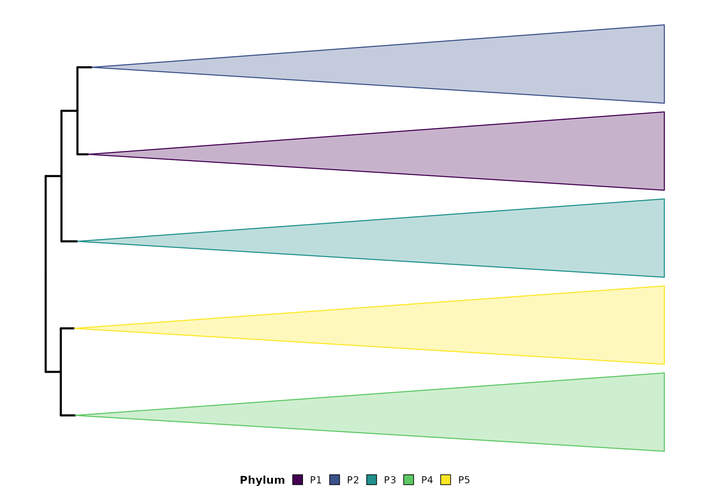

# Supported Taxonomy Label Formats

## Overview

Rclade automatically detects and parses four taxonomy label formats:

| Format          | Separator  | Prefix | Example                               |
|-----------------|------------|--------|---------------------------------------|
| **GTDB**        | `;`        | `__`   | `d__Bacteria;p__Proteobacteria`       |
| **Silva**       | `;`        | none   | `Bacteria;Proteobacteria`             |
| **NCBI**        | `;`        | none   | `cellular organisms;Bacteria`         |
| **Custom rank** | `_` + code | none   | `species_d_Bacteria_p_Proteobacteria` |

## Automatic Detection

``` r

library(Rclade)

# Load example data
data(example_tree)

# Auto-detection works in most cases
p <- plot_timetree(example_tree, rank = "phylum",
                   taxonomy_format = "auto",
                   add_timescale = FALSE)
#> 
#> ============================================================
#>            Rclade: Phylogenetic Tree Visualization
#> ============================================================
#> 2026-08-21T14:18:04.161+00:00 | INFO     | Starting plot_timetree pipeline
#> 2026-08-21T14:18:04.162+00:00 | INFO     | Tree input               : phylo object
#> 2026-08-21T14:18:04.163+00:00 | INFO     | Rank                     : phylum
#> 2026-08-21T14:18:04.163+00:00 | INFO     | Layout                   : rectangular
#> 2026-08-21T14:18:04.163+00:00 | INFO     | Unit                     : auto
#> 2026-08-21T14:18:04.165+00:00 | INFO     | Step 1/7: Input validation and reading
#> 
#>   --------------------------------------------------
#>   >> Input Validation
#>   --------------------------------------------------
#> 2026-08-21T14:18:04.167+00:00 | INFO     | Tips                     : 50
#> 2026-08-21T14:18:04.167+00:00 | INFO     | Internal nodes           : 49
#> 2026-08-21T14:18:04.168+00:00 | INFO     | Edge lengths range       : 40.1579 to 2758.4006
#> 2026-08-21T14:18:04.169+00:00 | INFO     | Input validation passed
#> 2026-08-21T14:18:04.169+00:00 | INFO     | Timer 'input_reading': 4 ms
#> 2026-08-21T14:18:04.170+00:00 | INFO     | Step 2/7: Taxonomy parsing
#> 2026-08-21T14:18:04.171+00:00 | INFO     | Using rank-based taxonomy: phylum
#> 2026-08-21T14:18:04.183+00:00 | INFO     | Detected format          : GTDB
#> 2026-08-21T14:18:04.184+00:00 | INFO     | Groups found             : 5
#> 2026-08-21T14:18:04.184+00:00 | INFO     | Timer 'taxonomy_parsing': 13 ms
#> 2026-08-21T14:18:04.185+00:00 | INFO     | Step 3/7: MRCA computation and monophyly check
#> 2026-08-21T14:18:04.185+00:00 | INFO     | Checking monophyly and computing MRCA for each group...
#> 2026-08-21T14:18:04.199+00:00 | INFO     | Valid groups for collapse: 5 out of 5 total groups
#> 2026-08-21T14:18:04.199+00:00 | INFO     | Valid MRCA nodes         : 5
#> 2026-08-21T14:18:04.200+00:00 | INFO     | Timer 'mrca_computation': 15 ms
#> 2026-08-21T14:18:05.063+00:00 | INFO     | Step 4/7: Color generation
#> 2026-08-21T14:18:05.070+00:00 | INFO     | Color palette            : viridis
#> 2026-08-21T14:18:05.071+00:00 | INFO     | Step 5/7: Tree rendering
#> ! # Invaild edge matrix for <phylo>. A <tbl_df> is returned.
#> ! # Invaild edge matrix for <phylo>. A <tbl_df> is returned.
#> 2026-08-21T14:18:05.311+00:00 | INFO     | Collapsing 5 clades...
#> 2026-08-21T14:18:05.343+00:00 | INFO     | Clade collapse complete
#> 2026-08-21T14:18:05.343+00:00 | INFO     | Timer 'tree_rendering': 271 ms
#> 2026-08-21T14:18:05.344+00:00 | INFO     | Step 6/7: Timescale integration
#> 
#> ============================================================
#>                       Pipeline Complete
#> ============================================================
#> 2026-08-21T14:18:05.446+00:00 | INFO     |   Tips              : 50
#> 2026-08-21T14:18:05.447+00:00 | INFO     |   Groups            : 5
#> 2026-08-21T14:18:05.447+00:00 | INFO     |   Groups collapsed  : 5
#> 2026-08-21T14:18:05.447+00:00 | INFO     |   Taxonomy format   : GTDB
#> 2026-08-21T14:18:05.448+00:00 | INFO     |   Layout            : rectangular
#> 2026-08-21T14:18:05.448+00:00 | INFO     |   Timescale         : disabled
#> 2026-08-21T14:18:05.448+00:00 | INFO     | plot_timetree completed successfully
```

Detection applies conservative “clear majority” rules: GTDB requires a
`[dpcofgsk]__` prefix-match score \>= 0.6 **and** a semicolon-delimiter
majority; embedded requires a `_[dpcofgsk]_` match score \>= 0.6;
NCBI/Silva first require a semicolon majority and then compare prefix
scores. Ambiguous labels fall back to `"unknown"`. Note that
accession-prefixed embedded labels with double-underscore separators
(e.g. `GCA_xxx_d__Archaea_p__Nanoarchaeota`) are correctly detected as
*embedded* (not GTDB) and are parsed by all three delimiter modes; for
label schemes with extra intermediate ranks (e.g. a `superphylum`
field), use `taxonomy_format = "custom_regex"` with explicit per-rank
patterns.

## Quality Report

Check how well your labels can be parsed before visualization:

``` r

labels <- example_tree$tip.label
summarize_taxonomy_quality(labels, format = "GTDB")
#> === Taxonomy Label Parsing Quality Report ===
#> Total labels: 50
#> Detected format: GTDB
#> 
#> Per-rank parse rates:
#>   kingdom        0.0% (0/50) 
#>   domain       100.0% (50/50) ====================
#>   phylum       100.0% (50/50) ====================
#>   class        100.0% (50/50) ====================
#>   order          0.0% (0/50) 
#>   family         0.0% (0/50) 
#>   genus          0.0% (0/50) 
#>   species        0.0% (0/50) 
#>   subspecies     0.0% (0/50) 
#> 
#> All labels parsed successfully.
```

## Manual Format Specification

If auto-detection fails, specify the format explicitly:

``` r

# GTDB format
p <- plot_timetree(example_tree, rank = "phylum",
                   taxonomy_format = "GTDB",
                   add_timescale = FALSE)
#> 
#> ============================================================
#>            Rclade: Phylogenetic Tree Visualization
#> ============================================================
#> 2026-08-21T14:18:05.732+00:00 | INFO     | Starting plot_timetree pipeline
#> 2026-08-21T14:18:05.732+00:00 | INFO     | Tree input               : phylo object
#> 2026-08-21T14:18:05.733+00:00 | INFO     | Rank                     : phylum
#> 2026-08-21T14:18:05.733+00:00 | INFO     | Layout                   : rectangular
#> 2026-08-21T14:18:05.733+00:00 | INFO     | Unit                     : auto
#> 2026-08-21T14:18:05.734+00:00 | INFO     | Step 1/7: Input validation and reading
#> 
#>   --------------------------------------------------
#>   >> Input Validation
#>   --------------------------------------------------
#> 2026-08-21T14:18:05.735+00:00 | INFO     | Tips                     : 50
#> 2026-08-21T14:18:05.735+00:00 | INFO     | Internal nodes           : 49
#> 2026-08-21T14:18:05.736+00:00 | INFO     | Edge lengths range       : 40.1579 to 2758.4006
#> 2026-08-21T14:18:05.737+00:00 | INFO     | Input validation passed
#> 2026-08-21T14:18:05.737+00:00 | INFO     | Timer 'input_reading': 3 ms
#> 2026-08-21T14:18:05.738+00:00 | INFO     | Step 2/7: Taxonomy parsing
#> 2026-08-21T14:18:05.738+00:00 | INFO     | Using rank-based taxonomy: phylum
#> 2026-08-21T14:18:05.747+00:00 | INFO     | Detected format          : GTDB
#> 2026-08-21T14:18:05.747+00:00 | INFO     | Groups found             : 5
#> 2026-08-21T14:18:05.748+00:00 | INFO     | Timer 'taxonomy_parsing': 10 ms
#> 2026-08-21T14:18:05.748+00:00 | INFO     | Step 3/7: MRCA computation and monophyly check
#> 2026-08-21T14:18:05.749+00:00 | INFO     | Checking monophyly and computing MRCA for each group...
#> 2026-08-21T14:18:05.751+00:00 | INFO     | Valid groups for collapse: 5 out of 5 total groups
#> 2026-08-21T14:18:05.752+00:00 | INFO     | Valid MRCA nodes         : 5
#> 2026-08-21T14:18:05.752+00:00 | INFO     | Timer 'mrca_computation': 4 ms
#> 2026-08-21T14:18:05.753+00:00 | INFO     | Step 4/7: Color generation
#> 2026-08-21T14:18:05.754+00:00 | INFO     | Color palette            : viridis
#> 2026-08-21T14:18:05.755+00:00 | INFO     | Step 5/7: Tree rendering
#> ! # Invaild edge matrix for <phylo>. A <tbl_df> is returned.
#> ! # Invaild edge matrix for <phylo>. A <tbl_df> is returned.
#> 2026-08-21T14:18:05.879+00:00 | INFO     | Collapsing 5 clades...
#> 2026-08-21T14:18:05.918+00:00 | INFO     | Clade collapse complete
#> 2026-08-21T14:18:05.918+00:00 | INFO     | Timer 'tree_rendering': 163 ms
#> 2026-08-21T14:18:05.919+00:00 | INFO     | Step 6/7: Timescale integration
#> 
#> ============================================================
#>                       Pipeline Complete
#> ============================================================
#> 2026-08-21T14:18:06.010+00:00 | INFO     |   Tips              : 50
#> 2026-08-21T14:18:06.011+00:00 | INFO     |   Groups            : 5
#> 2026-08-21T14:18:06.011+00:00 | INFO     |   Groups collapsed  : 5
#> 2026-08-21T14:18:06.012+00:00 | INFO     |   Taxonomy format   : GTDB
#> 2026-08-21T14:18:06.012+00:00 | INFO     |   Layout            : rectangular
#> 2026-08-21T14:18:06.013+00:00 | INFO     |   Timescale         : disabled
#> 2026-08-21T14:18:06.013+00:00 | INFO     | plot_timetree completed successfully
print(p)
```



## NCBI Format Handling

NCBI taxonomy uses position-based rank mapping. Note that this may
produce systematic rank offsets in non-standard lineages (e.g., viruses
where Riboviria is a realm, not a domain). For critical applications,
consider using GTDB or Silva format, or providing custom_patterns.

``` r

# NCBI format (requires NCBI-labeled tree)
p <- plot_timetree(ncbi_tree, rank = "phylum",
                   taxonomy_format = "NCBI",
                   add_timescale = FALSE)
```

## Custom Regex Patterns

For non-standard formats:

``` r

p <- plot_timetree(tree, rank = "phylum",
                   taxonomy_format = "custom_regex",
                   custom_patterns = list(
                     domain = "Domain:([^|]+)",
                     phylum = "Phylum:([^|]+)"
                   ))
```

## Embedded Format Parsing Strategies

For embedded (Format A) labels, Rclade supports three delimiter matching
strategies:

| Mode | Description | Best for |
|----|----|----|
| `reverse` (default) | Match ranks from right to left | Labels where taxon names contain underscores |
| `greedy` | Match ranks from left to right using character-class boundaries | Simple labels with no underscores in names |
| `segment` | Extract content between delimiters | Preserving underscores within values |

``` r

# Default reverse mode
p <- plot_timetree(tree, rank = "phylum",
                   taxonomy_format = "custom_rank",
                   taxonomy_delimiter_mode = "reverse")

# Segment mode for labels with underscores in taxon names
p <- plot_timetree(tree, rank = "phylum",
                   taxonomy_format = "custom_rank",
                   taxonomy_delimiter_mode = "segment")
```

## Custom Taxonomy Levels

You can extend or override the default rank codes and delimiters with
`taxonomy_levels`. This is useful for non-standard ranks such as kingdom
(`k`) or subspecies (`ss`).

For embedded (Format A) labels, provide a list of rank codes and their
prefixes:

``` r

p <- plot_timetree(tree, rank = "phylum",
                   taxonomy_format = "custom_rank",
                   taxonomy_levels = list(
                     codes = c("k", "d", "p", "c", "o", "f", "g", "s", "ss"),
                     names = c("_k_", "_d_", "_p_", "_c_",
                               "_o_", "_f_", "_g_", "_s_", "_ss_")
                   ))
```

The `codes` vector defines the short rank codes, and `names` defines the
delimiters used in the labels. The same `taxonomy_levels` object is
propagated through highlighting, monophyly checks, special identifier
resolution, and external taxonomy file merging.

## References & Acknowledgments

Rclade supports taxonomy formats from several databases. If you use data
from these sources in published research, please cite them
appropriately:

- **GTDB**: Parks DH, Chuvochina M, Chaumeil PA, Rinke C, Mussig AJ,
  Hugenholtz P (2020). “A complete domain-to-species taxonomy for
  Bacteria and Archaea.” *Nature Biotechnology*, 38(9), 1079-1086.
  <doi:10.1038/s41587-020-0501-8>
- **SILVA**: Quast C, Pruesse E, Yilmaz P, Gerken J, Schweer T, Yarza P,
  Peplies J, Glöckner FO (2013). “The SILVA ribosomal RNA gene database
  project: improved data processing and web-based tools.” *Nucleic Acids
  Research*, 41(D1), D590-D596. <doi:10.1093/nar/gks1219>
- **NCBI Taxonomy**: Sayers EW, et al. (2022). “Database resources of
  the National Center for Biotechnology Information.” *Nucleic Acids
  Research*, 50(D1), D20-D26. <doi:10.1093/nar/gkab1112>

Rclade also builds on the **ggtree** and **deeptime** R packages:

- Yu G, Smith DK, Zhu H, Guan Y, Lam TT-Y (2017). “ggtree: an R package
  for visualization and annotation of phylogenetic trees.” *Methods in
  Ecology and Evolution*, 8(1), 28-36. <doi:10.1111/2041-210X.12628>
- Gearty W (2025). “deeptime: an R package for visualizations of data
  over geological time intervals.” *Big Earth Data*.
  <doi:10.1080/20964471.2025.2537516>
